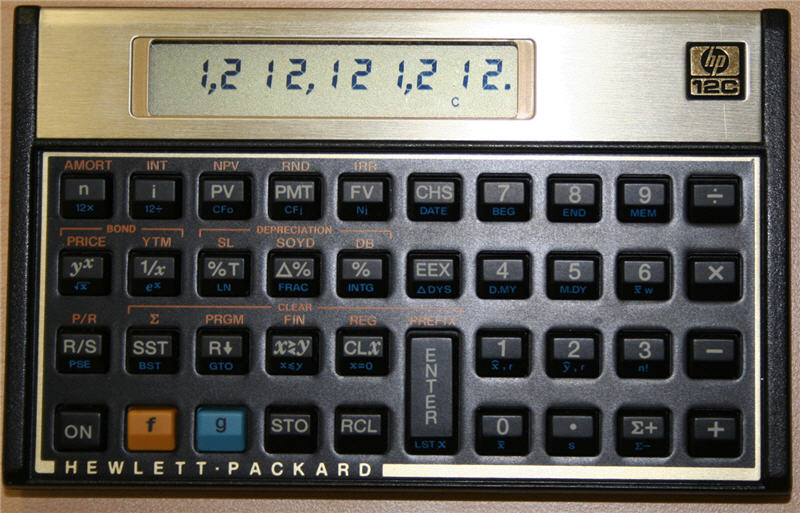

# Beispiel "RPN Calculator"

## Einführung

Die Notation eines mathematischen Ausdrucks, wie wir ihn aus der Mathematik kennen, zum Beispiel 2 \* (7 + 5),
bezeichnet man als *Infix*-Notation.
Das Gegenstück dazu heißt *Postfix*-Notation oder *UPN* (*umgekehrte polnische Notation*).

Die umgekehrte polnische Notation wurde 1920 von dem Polen *Jan Lukasiewicz* erfunden,
um mathematische Ausdrücke ohne Vorrangregeln (Klammern) schreiben zu können.

Wie sieht diese Notation aus? 
Der zu berechnende Ausdruck wird so umgestellt, dass jeweils jeder Operator seinem bzw. seinen Operanden folgt.
Statt 1 + 2 (gewöhnliche Notation) heißt es in UPN: 1 2 +.
Auf diese Art werden auch komplexere Ausdrücke geschrieben: (1 + 2) \* 3 wird zu 1 2 + 3 \*, und 1 + 2 \* 3 wird zu 1 2 3 \* +.
Man sieht, dass keine Klammern mehr benötigt werden!

Die *UPN*-Notation wird sogar von einigen Programmiersprachen wie *Forth* oder *Postscript* verwendet.

Die Berechnung von *Postfix*-Ausdrücken ist viel leichter zu programmieren, als dies für *Infix*-Terme
der Fall ist. Außerdem benötigt die *Postfix*-Notation keine Klammern oder Prioritäten der Operatoren, da
die Reihenfolge der Abarbeitung schon implizit durch den Ausdruck bestimmt wird. Ein weiterer Vorteil ist die
schnellere Abarbeitung im Vergleich zur *Infix*-Darstellung.

Der [HP 12c Financial Calculator](https://support.hp.com/hr-en/document/c01903600) (siehe Abbildung 1) wird bis heute noch hergestellt - er arbeitet aus Basis RPN.

Abbildung 1: HP 12c Financial Calculator.

---

[Zurück](../../../Readme.md)
