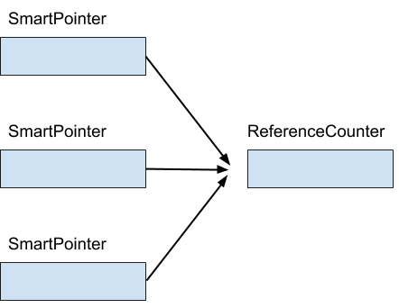

# Beispiel "Einfache Realisierung einer *SmartPointer*-Klasse"

Die wichtigste Stelle in der Realisierung der `SmartPointer`-Klasse ist der Trick mit einer inneren Klasse (hier: Klasse `ReferenceCounter`).

Diese verwaltet einen sogenannten *Referenzzähler*, also eine Variable, die mitzählt, wieviele Clients das "raw pointer"-Objekt in Gebrauch haben.

Zum anderen ist zu beachten, dass die Instanz des inneren `ReferenceCounter`-Objekts immer flach zwischen verschiedenen `SmartPointer`-Objekten
kopiert wird. Auf diese Weise wird erreicht, dass alle `SmartPointer`-Objekte denselben Referenzzähler haben.

Auch wird der Zeiger (`T *`) auf das eigentliche Zielobjekt flach hin und her kopiert. 

Abbildung 1: Mehrere `SmartPointer`-Objekte verwenden einen gemeinsamen Referenzzähler.
